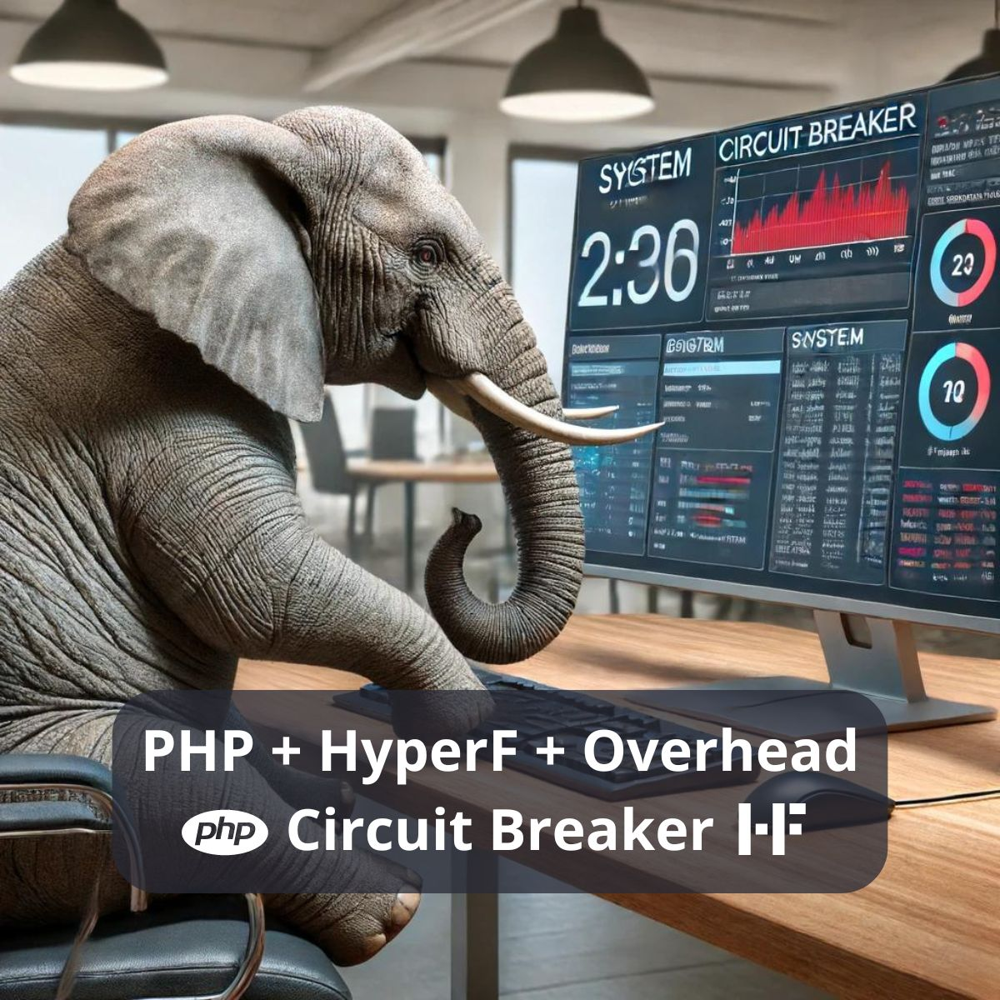

# PHP HyperF -> Overhead + Circuit Breaker

- PHP: 8.3.7
- PHP HyperF: 3.1.23

## HyperF - Project

This test execute calc of Fibonacci to show how HyperF behaves with overload, after use the maximum CPU and requests, the next requests do not respond, the system get into a circuit breaker.



#### Create - Project

```console
composer create-project hyperf/hyperf-skeleton "project"
```

#### Install - Watcher

```console
composer require hyperf/watcher --dev
```

#### Server - Start

```console
cd project ;
php bin/hyperf.php server:watch ;
```

## HyperF - PHP

Set a time limit of one minute just for testing.

```php
set_time_limit(60);
```

> Path: project/bin/hyperf.php

## HyperF - APP

#### APP - Config - Server

Limit to one process and one request at a time.

```php
return [
	'settings' => [
		Constant::OPTION_WORKER_NUM => 1,
		Constant::OPTION_MAX_REQUEST => 1,
	],
];
```

> Path: project/config/autoload/server.php

#### APP - Router

```php
Router::addRoute(['GET', 'POST'], '/stress', 'App\Controller\ControllerOverhead@stress');
Router::addRoute(['GET', 'POST'], '/data', 'App\Controller\ControllerOverhead@data');
```

> Path: project/config/routes.php

#### APP - Controller - Overhead

```php
namespace App\Controller;

class ControllerOverhead
{
	public function fibonacci($number)
	{
		if($number==0)
			return 0;
		elseif($number==1)
			return 1;
		else
			return ($this->fibonacci($number-1)+$this->fibonacci($number-2));
	}
	public function stress()
	{
		$time=microtime(true);
		$fibonacci=$this->fibonacci(40);
		$data=[
			'time'=>microtime(true)-$time,
			'fibonacci'=>$fibonacci,
		];
		return $data;
	}
	public function data()
	{
		$time=microtime(true);
		$content='data';
		$data=[
			'time'=>microtime(true)-$time,
			'content'=>$content,
		];
		return $data;
	}
}
```

> Path: project/app/Controller/ControllerOverhead.php

## Execute

#### GET - Data

```console
curl "http://127.0.0.1:9501/data"
Response OK
```

#### GET - Stress

```console
curl "http://127.0.0.1:9501/stress"
Wait... Response OK
```

#### GET - Overload

```console
curl "http://127.0.0.1:9501/stress" && curl "http://127.0.0.1:9501/data"
Wait... Error -> Response only first request
```

## Conclusion

The greater the processing power and network of your server, the greater the HyperF configuration can be.
In HyperF is default settings, the number of workers is equal the number of CPUs, and 100k requests maximum.
